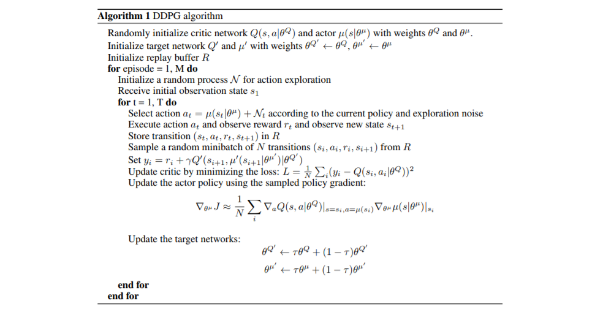
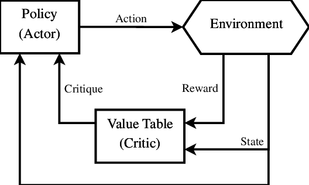
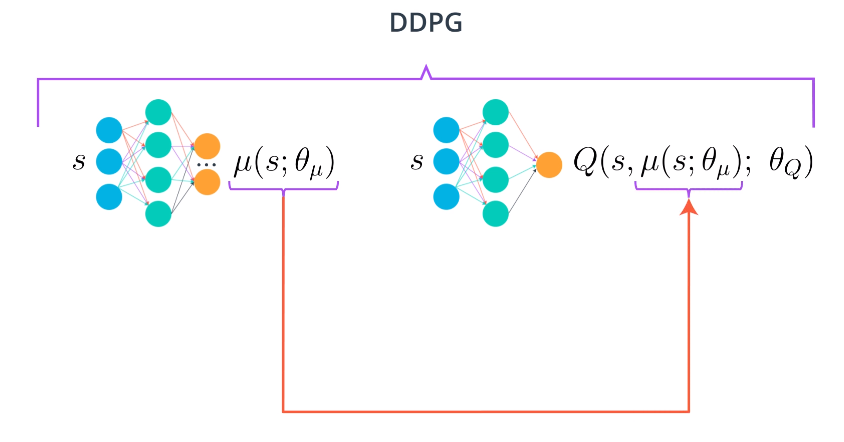

In 2016, Lillicrap, et al., published ["Continous Control With Deep Reinforcement Learning"](https://arxiv.org/pdf/1509.02971.pdf), which took the DQN algorithm as inspiration and applied the Deterministic Policy Gradient algorithm in order to operate in environments with continous action spaces.

The algorithm is as follows:

  <b>Actor Critic</b>

For other reinforcement learning algorithms in this github (SARSA, DQN, Discretization), the goal of the agent was to populate a Q-Table (please refer to these algorithms for an explanation). From this state-action -> value table, the optimal policy (state -> action) could be derived. That is, given a state S, the agent should take action A in order to maximize expected returns.

As it turns out, we can use a neural network to directly approximation the policy function, circumventing the population of a value function (Q-Table). However, a direct approximation such as this introduces a high degree of variance into the system, as is common with policy based methods. 

In order to reduce the variance of the system, an actor-critic approach is implemented. The critic will use a neural network to obtain TD estimates and construct a baseline. This baseline will be used to evaluate the decisions of the actor - that is, the network populating the policy function.

  

  <small> basic actor-critic structure </small>

Such a TD estimation method has much lower variance than policy based methods, but a higher bias. This is to say, that bias is being introduced into the system; expected TD rewards (a guess, in the most high-level sense) will be biased due to a lack of experience early on and either be over-estimates or under-estimates. Regardless, these estimates will maintain their value throughout several time steps - again, low variance and high bias).

It has been shown that even though bias is introduced into the system, the presence of both an actor and critic (i.e., state-value estimation and policy estimation) produce an agent that learns a higher quality policy faster than either method alone. 

  <b>DDPG Divergence</b>

  

DDPG diverges from the traditional Actor-Critic architecture discussed above in that the actor is not populating a distribution of action probabilities (a stochastic policy) and the critic is not populating a baseline. Rather, the actor (neural network on the left) seeks to learn the single action that maximizes expected reward for a given state; this is a deterministic policy. 

Likewise, the critic (neural network on the right)  uses this action to estimate the optimal action-value function using the actors best guess. This implementation is described in the algorithm above and is very reminiscent of the implementation in a Deep Q-Network.

In addition, the authors employ target networks for both the actor and critic. Stating that the absense of these target networks resulted in very poor performance in many environments. 

  <b>Application & Results</b>

The DDPG algorithm was used to train an agent to control a doubly-jointed arm with a [Unity Machine-Learning Agent Environment](https://github.com/Unity-Technologies/ml-agents). The goal of the agent is to apply torque to each joint in order to position the end of the arm within a target location in space. 

A reward of +0.1 is provided for each step that the agent's hand is in the goal location. Thus, the goal of the agent is to maintain its position at the target location for as many time steps as possible.

The observation space consists of 33 variables corresponding to position, rotation, velocity, and angular velocities of the arm. Each action is a vector with four numbers, corresponding to torque applicable to two joints. Every entry in the action vector is a number between -1 and 1.

The following video showcases the agents ability to learn through successive episodes and, ultimately, position the joint at the target location for an extended period of time.

    
 

