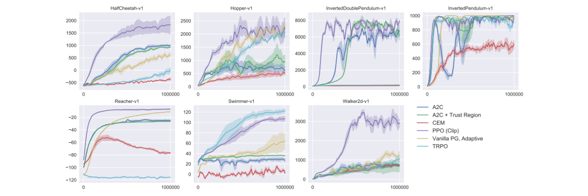
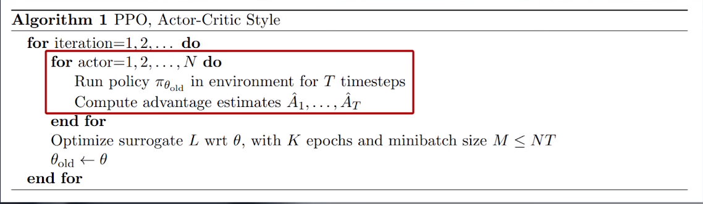

# 
<b>Proximal Proxy Optimization</b>

In 2017, Schulman, et al., introduced PPO as a policy gradient algorithm that is scalable, robust, and data efficient. Using Trust Region Policy Optimization (TRPO) as inspiration, the authors designed PPO to be simplier to implement and better at generalization, all the while outperforming TRPO, DQN, and other "vanilla" policy gradient methods.

In the figures above, PPO outperforms previous methods on nearly all continous control environments. That is, environments with both continous observation and action spaces.

PPO is an on-line method. One of the salient details of on-line learning involves the collection of a finite number of *sequential* experiences that are then learned from and discarded. As such, PPO (and policy gradient methods, in general) are less sample efficient than off-policy methods, such as Deep Q-Network. For contrast, a DQN stores experiences in a Replay Buffer and samples these experiences at *random*.

If you are unfamiliar with a DQN and/or Replay Buffer, please view my detailed explanation elsewhere in this github.

The highlighted region of the PPO algorithm showcases this bootstrapping...

The paper begins by discussing a common gradient estimator and it's corresponding objective function. The objective function is given as,

This formula corresponds to equation (2) in paper and defines it as the expectation over the log of the stochastic action policy multiplied by an *estimate* of the advantage function output, A_hat. 

  <i>PPO Actor Critic</i>

