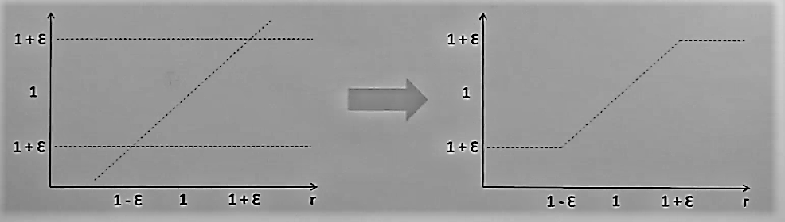

# 
<b>Proximal Proxy Optimization</b>

In 2017, Schulman, et al., introduced [PPO](https://arxiv.org/pdf/1707.06347.pdf) as a policy gradient algorithm that is scalable, robust, and data efficient. Using Trust Region Policy Optimization (TRPO) as inspiration, the authors designed PPO to be simplier to implement and better at generalization, all the while outperforming TRPO, DQN, and other "vanilla" policy gradient methods.

In the figures above, PPO outperforms previous methods on nearly all continous control environments. That is, environments with both continous observation and action spaces.

PPO is an on-line method. One of the salient details of on-line learning involves the collection of a finite number of *sequential* experiences that are then learned from and discarded. As such, PPO (and policy gradient methods, in general) are less sample efficient than off-policy methods, such as Deep Q-Network. For contrast, a DQN stores experiences in a Replay Buffer and samples these experiences at *random*.

If you are unfamiliar with a DQN and/or Replay Buffer, please view my detailed explanation elsewhere in this github.

The highlighted region of the PPO algorithm showcases this bootstrapping...

The paper begins by discussing a common gradient estimator and it's corresponding objective function. The objective function is given as,

This formula corresponds to equation (2). It is defined as the expectation over the log of the stochastic action policy multiplied by an *estimate* of the advantage function, A_hat. The goal, then, is to perform stochastic gradient ascent using this loss function which causes the agent to learn. 

### 
<b><i>PPO Actor Critic</i></b>

PPO implements an actor-critic method to populate the terms in the objective function. 

The actor is a neural network that takes as input the state of the environment and produces a Gaussian distribution for each action. In order to obtain a continous value for an action, the corresponding distribution is sampled. The actor is represented by the policy *pi* in the objective function above. 

The critic is used to estimate the value function, V(s) and is a neural network tha has only one output. The value function is responsible for mapping a given state to a value that reflects how "good" it is for the agent to be in that state. More specifically, the critic *estimates* the reward that the agent is most likely to receive from it's current state forward - until the end of the epsiode. In actor-critic terminology, the critic acts as a *baseline*.

The advantage function (A_hat) in the equation above is the difference between a *weighted* sum of all the rewards an agent receives during each timestep of an episode (known as "discounted rewards") and the *estimate* of the reward that the agent is most likely to receive from its current state forward (that is, the critic's output).

   sum of weighted rewards 

Since PPO is an online-policy that collects trajectories for some arbitrary period, the weighted rewards can be computed immediately after bootstrapping. In fact, this can be seen in the algorithm for PPO shown above, stated as "Compute Advantage Estimates". 

Note that the calculation of the weighted sum of rewards has no bias because these are the actual, true values. However, there is a significant amount of variance in these values, especially early on, as trajectories/epsiodes can take on drastically disparate sequence of actions. This behavior is similar to that seen in a typically Monte Carlo approach. On the other hand, the critic introduces significant bias and lower variance. Especially early on, since estimates are drawn from less experience. 

### 
<b><i>Dealing With Noise</i></b>

PPO draws inspiration from Trust Region Policy Optimization (TRPO) which, in short, ensures that a new policy does not *move* too far away from the old policy. The objective function used in TRPO is as follows,

The ratio of action policies is a measure of the likeliness of a certain actions between the current policy and an older policy. *NOTE: The capability of using distribution A to drawn values from distribution B is known as [Importance Sampling](https://en.wikipedia.org/wiki/Importance_sampling), as is implemented by TRPO to obtain this ratio*. A ratio greater than 1 indicates that the action is more probable under the newer policy and vice versa.

If the advantage function estimate produces negative values, then the multiplication of these values with the policy ratio will influence the agent to avoid these action. Conversely, if the advantage function estimate produces positive values, then the multiplication of these values with the policy ratio will encourage such actions in the given state. 

Such a concept is seen in the popular REINFORCE algorithm. 

Lastly, TRPO utilizes a [KL constraint](https://en.wikipedia.org/wiki/Kullback%E2%80%93Leibler_divergence) to ensure that the new policy distribution does not move "far away" from the old policy distribution. This concept addresses the propensity for large gradient steps to lead to instability in learning. Intuitively, we might not want to directly reflect a policy that significantly favors an action moreso than an older policy, especially early on in training, given that variance is significant.

In practice, the authors state how choosing a *beta* value that generalizes well is no easy task and that the TRPO object function introduces a significant amount of overhead. As such, the authors introduce a clipped objective function, given as follows,

In essence, clipping the objective function limits the probability ratio, *r (which is the current policy divided by the older policy)*, between (1-epsilon, 1+epsilon), where epsilon is a hyperparameter. By doing so, the policy avoids excessively large updates and mimics the behavior seen in TRPO's objective function.

The following is a graphical representation of the constrained values of the probability ratio,

### 
<b><i>Final Objective Function</i></b>

