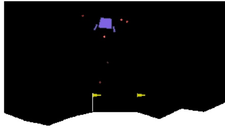

This work follows **Discretization Continuous Spaces**.

In prior approaches, a Q-Table was utilized to approximate an optimal action-value function for an agent in an environment. That is to say, given a state, the Q-Table provides an action for the agent to take within that environment that produces the maximum sum of rewards. 

When the state space is continuous, two approaches were implemented that discretized the space allowing for reinforcement learning algorithms to work with little modifications.

Another approach in dealing with continuous spaces is to approximate the non-linear value functions. Neural networks have been shown to perform very well in representing non-linear relationships across combinations of features. 

In fact, the paper ["Human Level Control Through Deep Reinforcement Learning"](https://storage.googleapis.com/deepmind-media/dqn/DQNNaturePaper.pdf) attempts to do just this.

Mnih, Volodymyr, et al. fuse a Deep Neural Network into the Q-Learning approach discussed elsewhere in this Github and produced a agent capable of playing 50 Atari videogames better than its human counter-part. 

The following notebook, inspired by the above paper, implements a Deep Q-Network on OpenAI Gym's Lunar Lander, which successfully trains an agent to land the space ship within the desired goal region.

