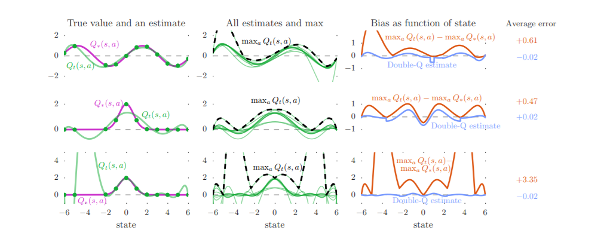
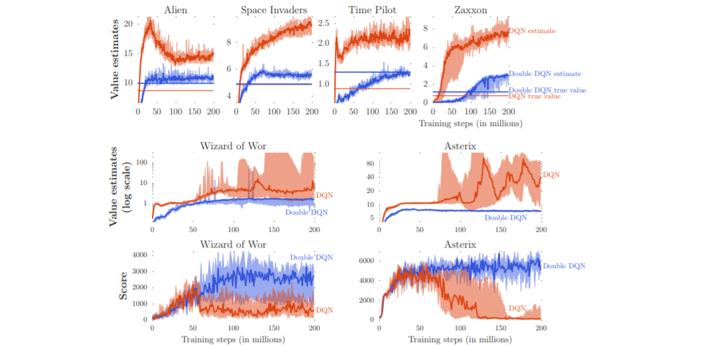
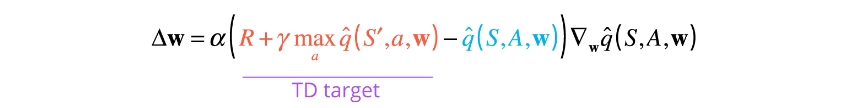
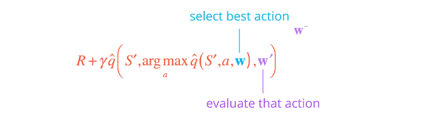
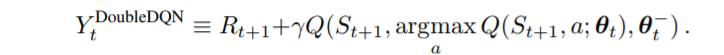
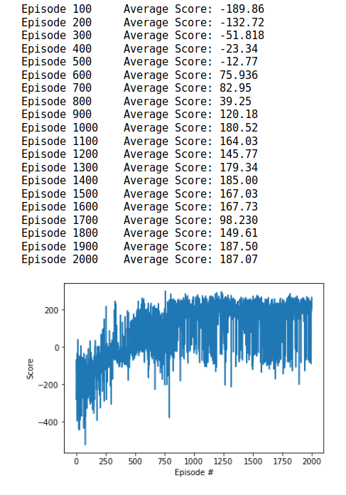
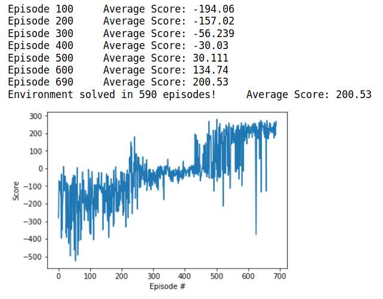

In 2015, Hasselt, et al. addressed the overestimation present in Q-Learning in the paper, ["Deep Reinforcement Learning with Double Q-Learning"](https://arxiv.org/pdf/1509.06461.pdf).

Due to Q-Learning including a maximization step over estimated action values, it can learn unrealistically high action values when these values are inaccurate. Moreover, inaccuracies of any kind can induce an upward bias, regardless of whether or not these errors are due to environmental noise, function approximation, non-stationarity, or any other souce. Since imprecise action estimates are the norm during learning, these overestimates are very common. 

The following graph showcases the degree to which overestimation is possible when Q-Learning is applied to function approximation of a continuous state with 10 discrete actions in each state. 

On the left column, the purple line is the true value. The middle column green line is all the estimated values. The black dashed line is the maximum of these values, where the maximum is much higher than the true value almost everywhere. 

Empirically, Hasselt, et al. showcase Q-Learnings overestimation on Atario 2600 games using the Atari Learning Environment. The following graph demonstrates DQNs over-optimism can be extreme. 

The graph shows DQN's overestimation in six Atari games, as well as the lesser quality policy that is generated by a DQN. Notice that the blue line is often higher than the orange line. Suggesting that a Double DQN network not only produces more accurate value estimates, but better policies, as well.

In order to address overestimation of Q-Learning, Hasselt, at el. decomposed the max operation in the target into action selection and action evaluation. Recall that the TD error is calculated using the following equation: 

In this approach, the max operator uses the same values both to select and to evaluate an action, which makes it more likely to select overestimated values, resulting in overoptimistic value estimates. 

The authors propose that the selection of the action to perform (a') that has the maximum expected q-value is to be obtained through the online network. That is, given a next state s', the online network will produce a vector corresponding to the q-values of each action in the action space. The action with the maximum q-value is chosen.

The same next state s' is inputted into the offline network to produce a vector of estimated q-values for each action. Using the next action a' produced by the online network, the corresponding q-value is chosen in the vector produced by the offline network. The following equation encompasses this:

By decoupling the action selection from the action evaluation, the authors were able to drive down overestimation significantly. Leading to faster learning times, more accurate value estimates, and overall higher quality policies. 

The updated TD Target equation now becomes: 

The following graph showcases the learning of an agent on OpenAI Gym's Lunar Lander environment using the standard DQN found in this GitHub. Notice the fluctuations in average score for the DQN and how it took significantly long to train.

The following graph showcases the learning of an agent on the same Lunar Lander Environment, but using a Double DQN. Notice how much faster the training has occured and the reduced fluctuations in average score. From a qualitative perspective, the GIF of the Lundar Lander for Double DQN performs considerably better than the standard DQN.

 
 

The following is the Double DQN agent in action landing the Lundar Rover safely within the goal region! The notebook in this directory will implement the DDQN and explain the steps in detail using PyTorch. The only change occurs in the learn() function of the Agent class. 

