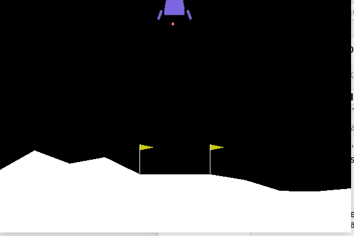

In 2015, Hasselt, et al. addressed the overestimation present in Q-Learning in the paper, ["Deep Reinforcement Learning with Double Q-Learning"](https://arxiv.org/pdf/1509.06461.pdf).

Due to Q-Learning including a maximization step over estimated action values, it can learn unrealistically high action values when these values are inaccurate. Moreover, inaccuracies of any kind can induce an upward bias, regardless of whether or not these errors are due to environmental noise, function approximation, non-stationarity, or any other souce. Since imprecise action estimates are the norm during learning, these overestimates are very common. 

The following graph showcases the degree to which overestimation is possible when Q-Learning is applied to function approximation of a continuous state with 10 discrete actions in each state. 

