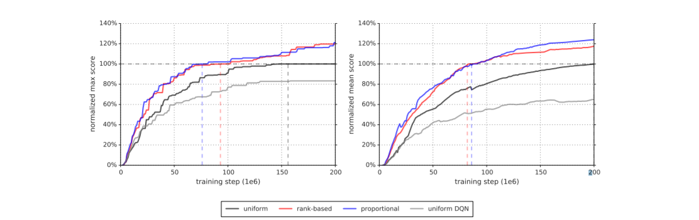
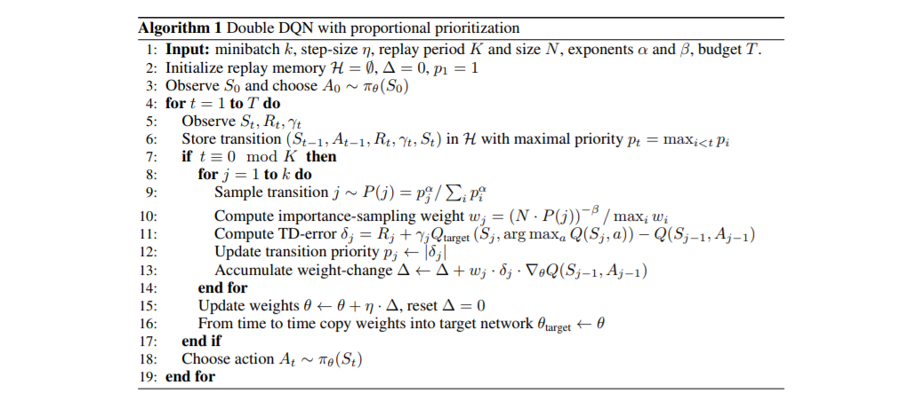

In 2016, Schaul, et al. developed a framework for prioritizing experience, so as to replay important transitions more frequently. The algorithm was presented in the paper, ["Prioritized Experience Replay"](https://arxiv.org/pdf/1511.05952.pdf).

The algorithm is an improvement over the method implemented in the Deep Q-Network by Mnih et al., which is discussed and implemented elsewhere in this GitHub. In that method, experiences were sampled uniformly, such that every transition in the memory bank has equal probability of being chosen for learning.

Schaul, et al. prioritized transitions according to TD error, which is the difference between the target TD value and the current TD value predicted by the network. The reasoning behind such a method is that transitions with a greater error implied a more significant potential for learning than transitions with a lower TD error. This claim is substantiated by numerous neurological studies, where experiences with significant TD errors appear to be replayed more often in the hippocampus of rodents.

The following graph shows a DQN with Prioritized Experience Replay (two types of implementations) outperforming a DQN with uniform experience sampling on the Atari 2600 benchmark. The dashed lines indicate the point at which the agents performing on par with human players.

The algorithm is implemented as follows:

It is important to note that when prioritization is introduced in this manner, the underlying distribution from which transitions are sampled is changed. Also, experiences with the largest TD error may starve out experiences with smaller errors closer to 0. The former issue affects gradient descent, as the estimation of the expected value with stochastic updates relies on those updates corresponding to the same distribution as its expectation. The latter issue affects diversity, as experiences with larger TD errors will be seen more and may make the system prone to overfitting.

To address the lack of diveristy inherent in TD-error based bias, Schaul, et al. introduced stochastic sampling that interpolates between pure greedy prioritization and uniform random sampling. The probability of sampling transition i is:

The exponent is a hyperparameter that determines how much prioritization is used, with alpha = 0 corresponding to the uniform case. 

To correct non-uniform probabilities introduced by prioritization, Schaul et al. applied Importance Sampling weights. These weights are folded into the Q-Learning update by multiplying these weights by the TD error prior to gradient descent. The IS weight for a particular transition is given as:

where N is the batch size and P(i) is the probability of transition for the particular experience (that is, state-action-reward-next_state-done tuple). Beta is a hyperparamter that is annealed over time to a value of 1 and is used to control the degree to which bias-correction is applied.  

The following video showcases an agent implementing a Double Deep Q-Network with Prioritized Experience Replay in order to collect yellow bananas and avoid blue bananas. The environment is within the [Unity Machine Learning Environment](https://unity3d.com/machine-learning), which allows for high-fidelity simulations. Agents can be trained on images of the simulation, which is very useful to the field of robotics, as well as obtain vectors of the state (as in this approach).

Please view the corresponding jupyter notebook for a more in-depth explanation of the algorithm. 

