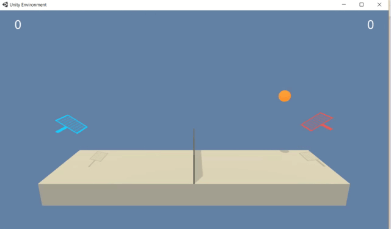

# 
<b>PPO For Tennis</b>

### 
<b><i>Application </i></b>

This notebook applies the PPO algorithm to the [Unity Tennis environment](https://github.com/Unity-Technologies/ml-agents/blob/master/docs/Learning-Environment-Examples.md).

Note: The PPO algorithm is discussed in depth elsewhere in this GitHub. Please refer to that [notebook](https://github.com/Shawn-Ricardo/Reinforcement-Learning/tree/master/Continuous_Spaces/ppo) to familiarize yourself with the concepts of PPO. Also, the actual notebook discusses the learning paramters and the network architecture in detail.

This Unity environment is a collaboration between two agents where the agents are to keep the ball in play for as long as possible. Each agent receives a +0.1 each time the ball is hit over the net.

The observation space is continuous and is a vector of size 8, corresponding to position and velocity of the ball and the racket. The action space is continuous and is a vector of size 2, corresponding to moving forward/backward and jumping.

Since the agents are NOT adversarial, the reward structure for each agent is identical and the PPO algorithm is shown to be successfully applied to this environment in nearly identical manner to the Unity Crawler Environment. Take a moment to note this importance of that statement: the same PPO algorithm is general enough to be applied successfully to a brand new, but somewhat similar environment; that is the goal of Deep RL.

The environment is considered solved when the average score over 100 consecutive episodes is greater than or equal to +0.5.

The environment can be downloaded [here](https://github.com/udacity/deep-reinforcement-learning/tree/master/p3_collab-compet).Make sure it is in the same directory as the jupyter notebook.

To run, tell the kernel to "Restart and Clear Output". Then, run each cell from top to bottom. The necessary packages other than the unity environment are imported. If you do not have the necessary packages, please import those listed.

### 
<b><i>Results</i></b>

Please view the notebook to see the plot of average rewards over episodes. As can be seen from the video below, the agents are able to successfully "solve" the environment and play tennis with each other!

    
 

### 
<b><i>Future Work </i></b>

As stated above, this environment is collaborative which affords certain characteristics that are conducive of the PPO algorithm. Future work includes an adversarial, zero-sum game. There are many approaches to attempting these types of environments, including the [Multi-Agent Deep Deterministic Policy Gradient](https://arxiv.org/abs/1706.02275) approach, which showed very promising results.
