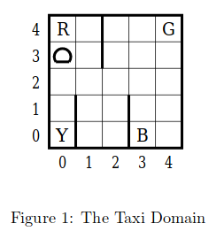

Use Expected SARSA to teach a taxi agent to navigate a small gridworld. 

Begin with a 5-by-5 grid world inhabited by a taxi agent. In this grid, world, there are 4 special cells marked R, B, G, and Y that correspond to pickup locations of a passenger.

Upon initialization, the taxi begins at a randomly selected cell. Likewise, the pickup/drop-off locations of the passenger are chosen at random from [R,B,G,Y]. 

Using the following 6 actions:

  1. Move North
  2. Move South
  3. Move East
  4. Move West
  5. Pickup
  6. Putdown

train a taxi agent to go to the passenger pickup location, pickup the passenger, navigate to the destination, and finally, drop-off the passenger, as efficiently as possible. That is, construct a policy that maximizes the total reward per episode (completes the fastest).

The agent receives a reward of -1 for each action and a reward of +20 for successfully delivering the passenger. If the taxi attempts to execute the Putdown or Pickup actions illegally, then a reward of -10 is given. In addition, an action causing a collision is deemed a no-op and given the usual reward of -1.

