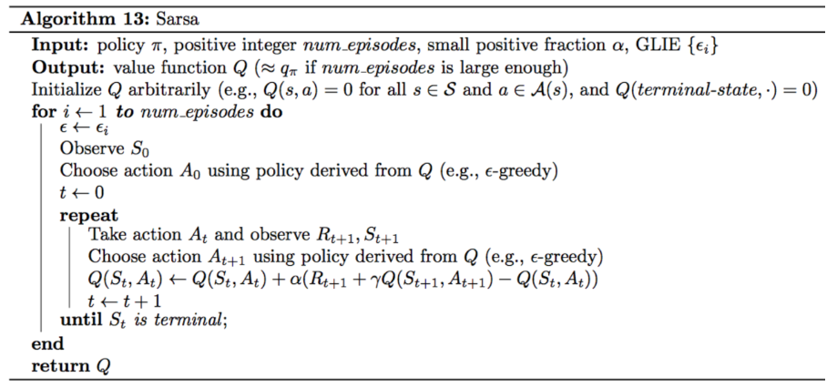
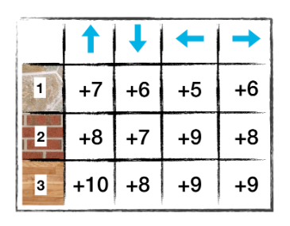
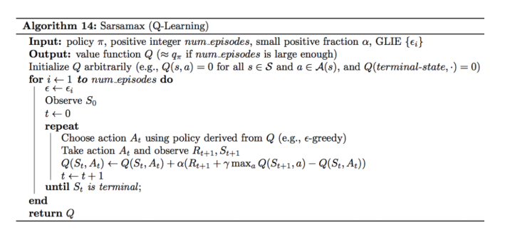

__SARSA - State, Action, Reward, Next State, Next Action__

SARSA is an approach that allows updating of the Q-Table without the need to complete an episode. This type of learning is valuable for real-world examples where discrete lines between active-state and end-state are not present or are fuzzy.

The following pseudocode describes the SARSA approach:

Given a starting state (s0), choose an epsilon-greedy action (a0) and observe the reward (r0) and next state (s1). In this next state, use the Q-Table to obtain the best action moving forward (a1) using, again, the epsilon-greedy approach. Obtain the corresponding reward (r1) that would be *expected* given this State-Action pair. 

Use these values to update the Q-Table for (s0, a0) by evaluating the equation above. 

The main crux of this approach is that we do not rely on the completion of an episode in order to update the Q-Table. We rely on the current values of the Q-Table, which have been updated as the agent moves throughout the environment, making decisions and observing the rewards of those decisions. 

As an example, consider the following table, where the desired goal is to arrive at State_4 (not shown in the table):

This table describes the *total* reward the agent expects to receive (at the very end of the epsiode) by implementing an action at the current state. This is to say that the reward is the cumulative reward from this (state, action) pair and a summation of future (state, action) pairs that were implemented along the episode. 

Suppose the agent starts in State_1 and chooses action "right". The agent then receives a reward of -1. After having chosen action right, the agent finds itself in State_2. At this point, the agent chooses an action based on the epsilon-greedy approach, which favors choosen an action that returns the highest expected reward, but also allows for exploration (that is, a smaller probability is given to actions that don't return the greatest reward).

The agent chooses action "right" again in State-2. 

Using the table and SARSA pseudocode, the (s0,a0) entry in the Q-Table can be updated as follows:

6 + 0.1(-1 + 8 -6) = 6.1

At this point, we have updated the Q-Table by using our current knowledge of the environment and the immediate reward that was received. 

__Q-Learning__

Q-Learning is very similar to SARSA. The only difference lies in which action is chosen after having arrived at the next state (s1). In SARSA, an action was chosen via the epsilon-greedy approach. In Q-Learning, the greedy approach is taken when choosing the action to execute at a given state. This greedy approach means the that the action that returns the greatest expected reward is chosen as the action to execute in the given state (s1). 

The following is pseudocode describes the Q-Learning approach:

Using the same Q-Table, suppose the agent finds itself in State_1 with an action of "right" that resulting in a reward of -1 and a resulting state of State-2.

The difference between SARSA and Q-Learning is at this point in time.

In Q-Learning, the agent always chooses the action that results in the greatest expected reward. That is, action "left".

At this point, the agent updates it's Q-Table:

6 + 0.1(-1 + 9 - 6) = 6.2

Thus, the expected reward for (State_1, action "right") is 6.2 from 6. 

Note: the value "0.1" is the *alpha* hyperparameter. It is set by the user and is a measure of the degree to which the new data affects the existing Q-Table value. If alpha is closer to 1, the new data is more heavily represented in the Q-Table. Conversely, if alpha is closer to 0, the new value more closely resembles the existing Q-Table entry.

